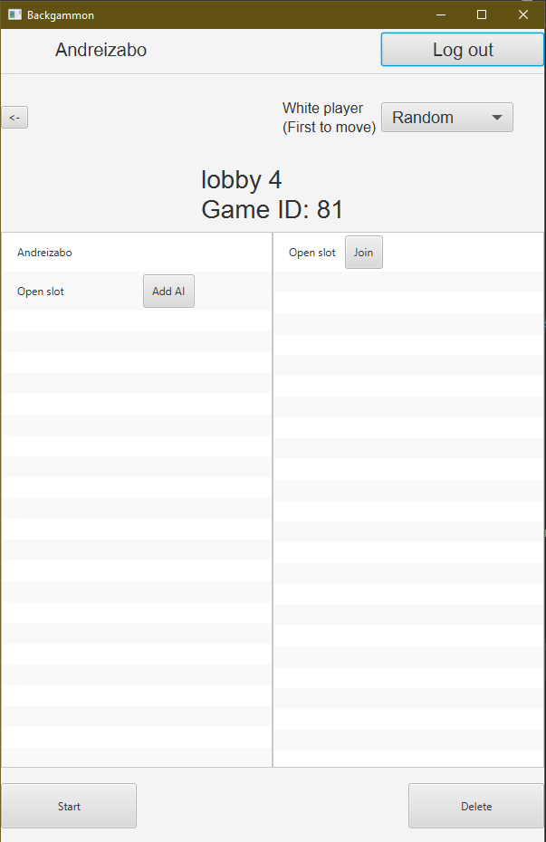
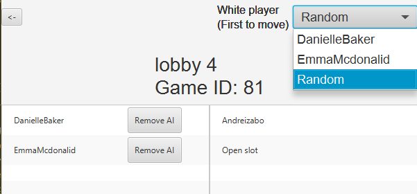
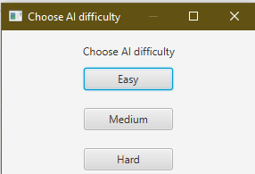
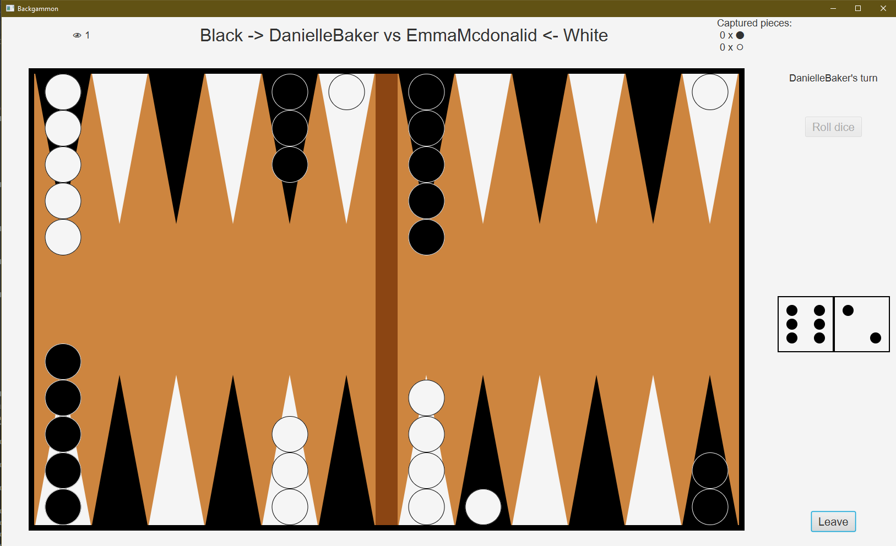
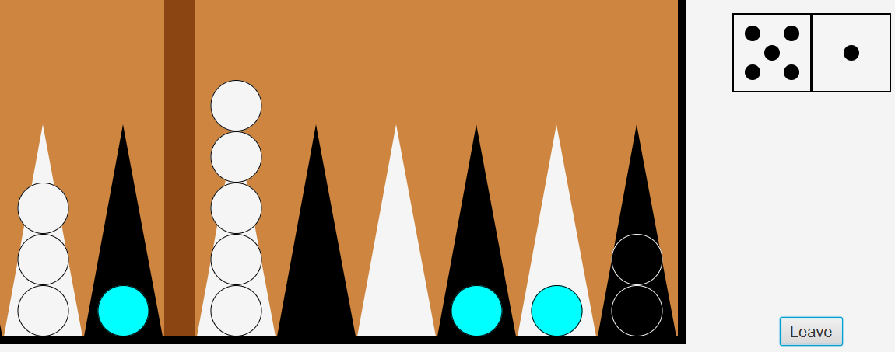
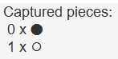
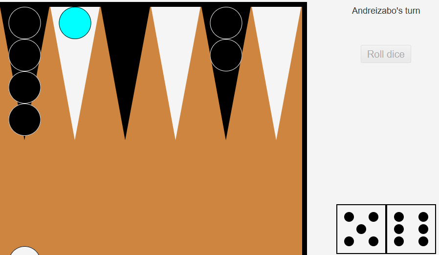
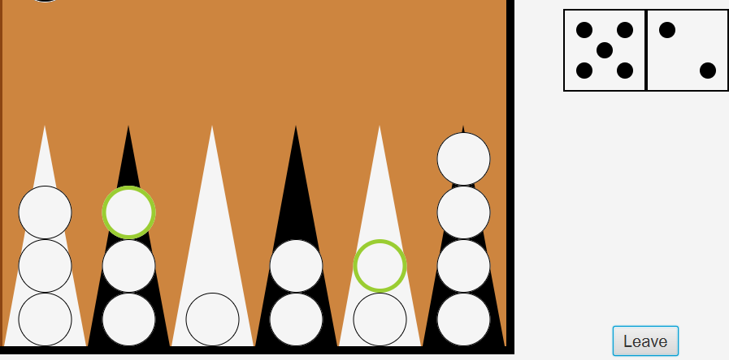
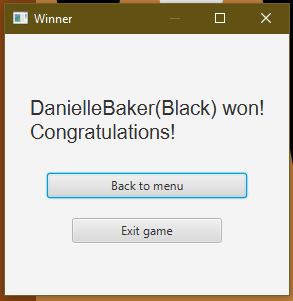

# Backgammon

This is an implementation of the game "Backgammon". We used a client-server approach to let multiple sessions (lobbies) co-exist. Therefore any number of players can play against each other in 1v1 games. In any game there can also be any number of spectators. They can watch the game, but they have no effect on it.

This project was developed by [Andrei Zaborilă](https://github.com/Andreizabo) and [Vlad Teodorescu](https://github.com/vladvlad00).

## General presentation

When the application is opened the user will be greeted with this screen: 

<center></center>  

If it's their first time opening the application, they should create an account by pressing the "Register" button in the top-right corner. Otherwise, they can log in by clicking on the button in the top-left corner.

<center>


</center>  
  
After logging in, the user can either create a new lobby, join one through its id or browse the lobby list

<center></center>

The lobby browser presents the user with a list of existing lobbies, each entry containing its name and how many players and spectators it currently has.

<center></center>

After joining or creating a lobby, the user will have to interact with the lobby creation screen. A normal user can only switch between being a spectator and a player (if there are enough spaces left for a new player) and leave the lobby.
The host of the lobby can also modify which player will be the white one (they will be the first to make a move during the game), delete the lobby or start the game.

<center></center>
<hr>
<center></center>

The host can also add AI opponents, with ranging difficulties:  
  * Easy AI => An AI opponent who chooses its moves at random
  * Medium AI => This AI opponent will use an Expectiminimax Algorithm
  * Hard AI => This is the toughest AI opponent, using GNU Backgammon

<center></center>

After starting the game, all the users will see the following frame

<center></center>

The board screen has multiple elements:  
  * In the top-left corner, the spectator counter. It displays how many spectators are currently watching the game
  * In the top-middle part of the screen, information about the players (their name and their colour)
  * To the right of the information about the players, the counter for how many captured pieces of each colour there are
  * In the top-right corner, whose turn it is, and a button to roll the dice. It is only available to the player whose turn it is now
  * In the right part of the screen, we can see the last pair of dice that has been rolled
  * In the bottom-right corner, a button that allows a user to leave. If one of the two players leaves, it is considered that they forfeit the game and the other one wins
  * In the middle of the screen, we have the board. It contains black and white pieces, placed on their starting positions at the beginning  
  
  We implemented the [standard rules of Backgammon](https://www.bkgm.com/rules.html).

  <center></center>

  When the current player presses on a valid piece, the allowed moves will be displayed as phantom cyan pieces. Those, when clicked on, will make the move associated to them.
  In the screenshot above, the white player pressed on the upmost piece of the leftmost column. 
  
  <center></center>
  <center></center>

  In the above screenshot one of the white player's pieces was captured, and they rolled a 5 and a 6. Since the sixth column has more than one black piece, they can't put their captured piece back there. The fifth column on the other hand is empty, so a phantom cyan piece appears on it, signifying that the player can put their piece back into the game there.

  <center></center>

  Lastly, when a player managed to move all of their pieces into their house, they can start removing them. Removable pieces have a thick yellow-green border, and will be removed when clicked. A piece is removable according to [the rules](https://www.bkgm.com/rules.html).

  When one of the players removes their last piece from the game, they win, and this popup appears on all the other players' screens. The game ends after this.

  <center></center>

  This is the basic flow of the application, from the user creating an account to them finishing a game.

## Front-end

  The front-end of the application uses only [JavaFX](https://openjfx.io/) as a main framework. The main sections of the application (menu, register, login and game) are represented through frames ([BorderPanes](https://docs.oracle.com/javase/8/javafx/api/javafx/scene/layout/BorderPane.html)), and have corresponding [Scenes](https://docs.oracle.com/javase/8/javafx/api/javafx/scene/Scene.html). They are made out of a multitude of changing panes ([GridPanes](https://docs.oracle.com/javase/8/javafx/api/javafx/scene/layout/GridPane.html)). Besides those main components, [Alerts](https://docs.oracle.com/javase/8/javafx/api/javafx/scene/control/Alert.html) and [Dialog Boxes](https://docs.oracle.com/javase/8/javafx/api/javafx/scene/Scene.html) are sometimes used.

## Back-end

  The back-end of the application uses [Spring Boot](https://spring.io/projects/spring-boot), [Spring Security](https://spring.io/projects/spring-security), [JWT](https://jwt.io/), [Spring Data JPA](https://spring.io/projects/spring-data-jpa), [MySQL](https://www.mysql.com/) and [WebSocket](https://www.baeldung.com/java-websockets).

## The Client and the Server
  
  The client is the only part of the application with an interactible user interface, whilst using many of the back-end technologies to communicate with the server. The server, having no user interface, exists to assure a proper way of communication between clients and to handle all the requests of the client.

  The client and the server communicate through two different ways:  
  * HTTP => It is used for CRUD operations for users, lobbies and for the AI algorithms
  * WebSocket => It is essential because it allows a bidirectional communication that is also fast during the game
  
  A certain protocol must be respected for the WebSocket communication. Whenever someone sends or receives a message the [Message](/src/main/java/back/websocket/Message.java) class is used

  ```java
public class Message
{
    private String command;
    private Map<String, String> options;
    //...
}
```

  The usual flow is of this kind: The user sends a message to the server, the server interprets the message and then broadcasts it to all the users currently connected to the same lobby as the first user.

## The AI

### Easy

  There's not much to say about the AI of the easiest difficulty. Firstly all the allowed moves are generated, then the AI chooses one at random.

### Medium

  This AI uses an [Expectiminimax Algorithm](https://en.wikipedia.org/wiki/Expectiminimax). This is a variation of the normal [Minimax Algorithm](https://en.wikipedia.org/wiki/Minimax), with the notable change that Expectiminimax also takes into random events (like dice throws) by using an additional type of node, a chance node. The value of a chance node is the expected value of the position, taking into account any dice roll possible (it is represented by the weighted sum of the min/max nodes corresponding to each dice roll). The evaluation function used to calculate the value of leaf nodes if an heuristic based on multiple factors: the number of removed pieces, the num of captured pieces, the position of the pieces still in the game and the number of exposed pieces (which could be captured by the opponent in his turn), for both players.

### Hard

  This AI uses [GNU Backgammon](https://www.gnu.org/software/gnubg/). GNU Backgammon evaluation functionality is driven by 3 separate neural networks. The neural nets evaluate each position statically, and returns the outcome probabilities of the game at the given position. This opponent is meant to be able to defeat almost any regular player, and can only be beaten by very experienced ones.

## Contribution
  We worked together on the project, communicating thorugh [Discord](https://discord.com/) thorughout the whole implementation process and using [Github](https://github.com/) to seamlessly work on different parts of the code.
  
  Andrei's main objective was the implementation of the client, while Vlad's was the implementation of the server.

### The interface
  This part was mostly implemented by Andrei, Vlad's contributions being mainly suggestions and opinions regarding how the application should look.

### The communication between the server and the client
  This part was implemented on the client side by Andrei and on the server side by Vlad, a common protocol being established for an easy client-server communication

### The authentication
  Similar to the previous point, the client side was implemented by Andrei and the server side by Vlad, the database structure being proposed by the former and the database itself being set up by the latter.

### The event system
  This uses WebSockets. The server side of this was implemented by Vlad, while the listeners and the event fire-ers where set up by Andrei.

### The Backgammon game
  Besides the interface, Andrei also implemented the allowed moves prediction (the most complex part of the whole implementation of the client-side game) for the client-side and assured that the game flow is natural and there are as few bugs as possible. Vlad worked on the server side of this, making the moves requested by the players and broadcasting them further.

### The AI
  Vlad implemented all three of the AIs, while Andrei's contributions were mainly suggestions and opinions regarding their implementation.

### Bugs and glitches
  We both encountered a hefty number of bugs throughout the implementation process. Small bugs were fixed by whomever encountered them first, but whenever one of us would find a bigger bug, which was not a quick fix, we would both look into it and try to find a fix. This cooperation in bug fixing assured that we never wasted too much time fixing bugs, this allowing us to have more time to develop the application and add as many planned features as possible.
